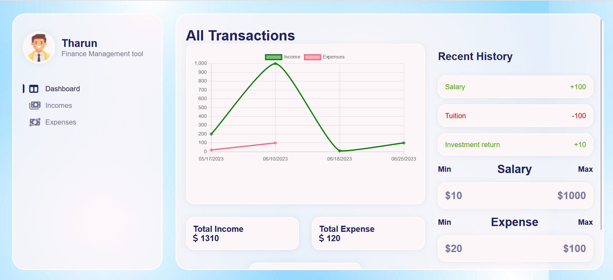
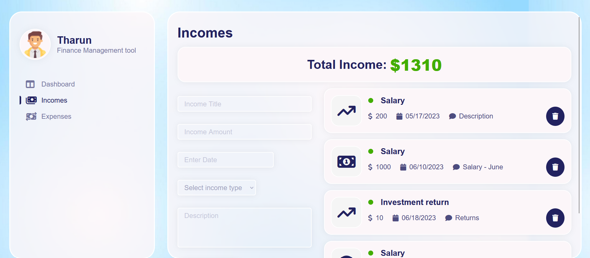
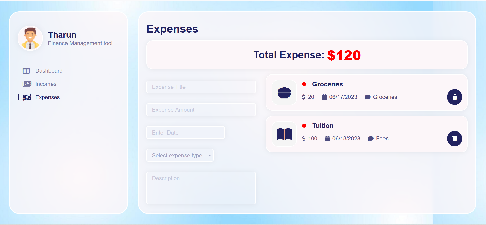

# finance_management_application
This application consists of  dashboards built with React library and Tailwind CSS technologies and is used to visualize &  manage personal finances efficiently.

## Technologies used
* [ReactJS](https://react.dev/) is a free and open-source front-end JavaScript library for building user interfaces based on components.
* [JavaScript](https://developer.mozilla.org/en-US/docs/Web/JavaScript) is a lightweight interpreted (or just-in-time compiled) programming language with first-class functions.
* [Tailwind CSS](https://tailwindcss.com/docs/installation) works by scanning all of your HTML files, JavaScript components, and any other templates for class names, generating the corresponding styles and then writing them to a static CSS file.It's fast, flexible, and reliable — with zero-runtime.
* [HTML5](https://html.com/html5/) used to create the web page UI)

## Setup

* Download the repository, navigate to the root folder and run the command "npm install" to install dependencies
* Now run the command "npm start" to start up the server
* Navigate to localhost:3000 to see the Home page

## Screenshots

* Home Component

.

* Income Component

.

* Expense Component

.